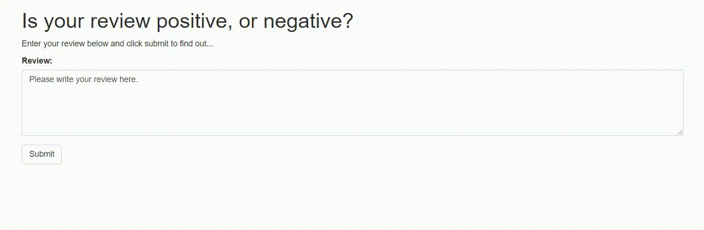

# Sentiment Analysis Model Deployment Using Amazon SageMaker

This is the first deployment project which is part of the MLE Nanodegree.
The project is constructed using a RNN (Recurrent Neural Network) for the purpose of determining the sentiment of a movie review using the IMDB data set. 
The model is developed using Amazon's SageMaker service.
A simple web app is also developed for the user interaction.
The web app provides the users with an interface to provide their reviews and getting an instant feedback on their review being POSITIVE or NEGATIVE.

<br />The application architecture looks like the diagram below: 

 
<br />The diagram above gives an overview of how the various services work together. 
On the far right is the model which we train and is deployed using SageMaker. 
On the far left is the web app that collects a user's movie review, sends it off and expects a positive or negative sentiment in return.

  In the middle is where some of the magic happens. We construct a AWS Lambda function, 
  which you can think of as a straightforward Python function that can be executed whenever a specified event occurs. 
  This function is granted permission to send and recieve data from a SageMaker endpoint.

  Lastly, in order to execute the Lambda function a new endpoint is created using AWS API Gateway. 
  This endpoint is a url that listens for data to be sent to it. Once it gets some data it will pass that data on to the Lambda function 
  and then return whatever the Lambda function returns. Essentially it acts as an interface that lets the web app communicate with the Lambda function.
  
  Please refer the ```SageMaker Project.ipynb``` for better understanding of model development and how to integrate these services.
  
  ## Prerequisites
1. AWS Account
2. Experience with model development on AWS SageMaker
3. Basic HTML, CSS and JS
4. Familiarity with AWS services like S3, API Gateway and Lambda
  
  ## Setup instructions
```
cd SageMaker
git clone https://github.com/rohanjn98/sentiment-analysis-sagemaker-deployment.git
exit
```

## Web app demo

 

<br />The endpoint is currently inactive to avoid recurring charges. If you wish to use your own endpoint please update the same in index.html at mentioned tag, thanks.
